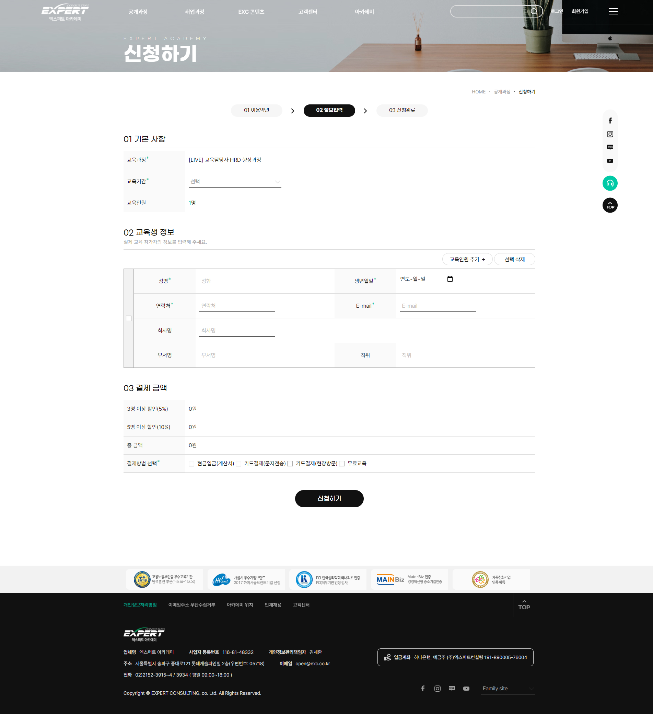
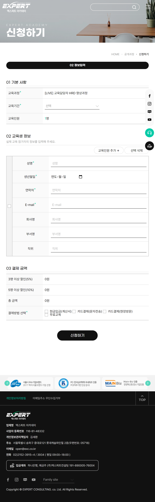
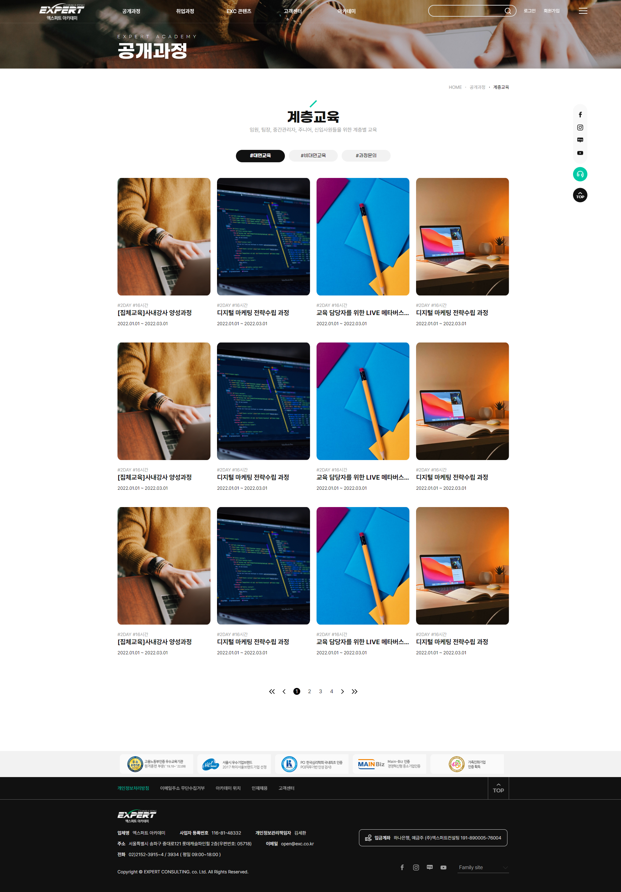
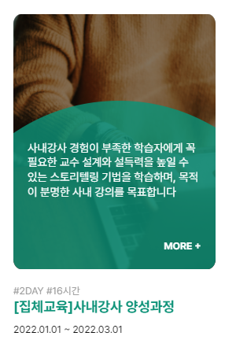
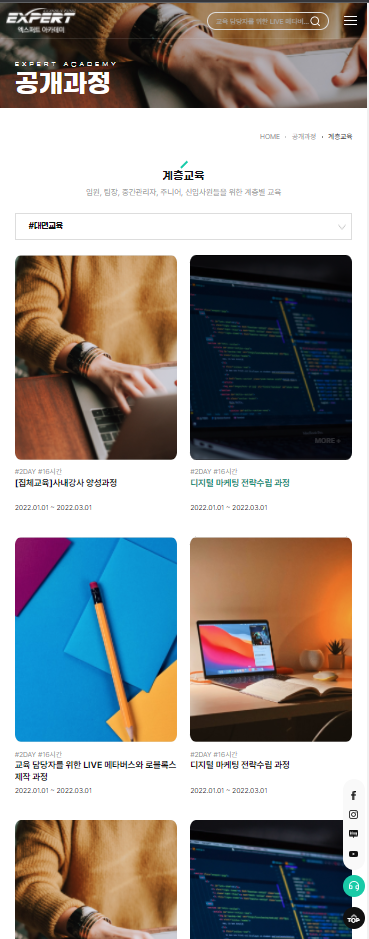

# 팀 로켓단 프로젝트 (엑스퍼트 아카데미 홈페이지 리뉴얼/반응형)
## 1. 개요
---
'청년취업사관학교 새싹(Sesac) 프론트엔드 실무 교육과정'의 팀 프로젝트입니다. 교육담당기관인 엑스퍼트 아카데미의 홈페이지 리뉴얼 프로젝트이며, 전체적인 UI, UX 개선과 함께 기업에서 요구한 기능을 구현하였습니다.

## 2. 담당 페이지
---
담당한 총 8페이지 중 주요 페이지를 소개합니다.
### 신청하기, 정보 입력 페이지

* 필수정보 유효성 검사
* 버튼 클릭 이벤트: DIV테이블 추가 및 선택 삭제(체크박스)
* 수강생 인원 수에 따라 결제 금액 자동 계산

  

  
---
### 교육과정 페이지

 

* 카드 UI
* Hover 효과: 그림자, 원형 꾸미기, 더 보기 버튼, 텍스트, 제목 색상 변화
* 수강생 인원 수에 따라 결제 금액 자동 계산

 

 

## 3. Skills & Tools
---
* HTML
* CSS
* Javascript
* JQuery
* Figma
* Notion

 

## 4. 프로젝트 발표 영상
---
[발표영상 보러가기](https://www.youtube.com/watch?v=kJX8GYN-jA8)
